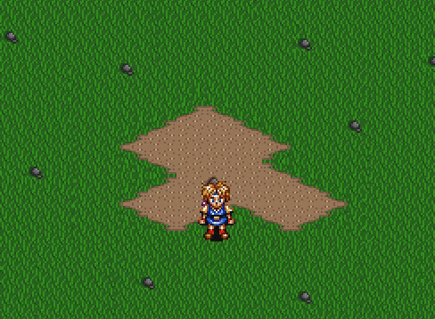

# Ring Menu Test

Testing creation of a Secret of Mana/Evermore style ring menu in Godot.

## Input Actions

| Action | Keyboard | Xbox / PlayStation / Switch | Description |
|--------|----------|-----------|-------------|
| Menu | Esc Key | X Button / Square Button / Y Button | Open/close the ring menu |
| Move Left | Left Arrow | D-Pad Left / Left Stick Left | Rotate through items in the current category |
| Move Right | Right Arrow | D-Pad Right / Left Stick Right  Rotate through items in the current category |
| Move Up | Up Arrow | D-Pad Up / Left Stick Up | Navigate to previous category |
| Move Down | Down Arrow | D-Pad Down / Left Stick Down | Navigate to next category | 